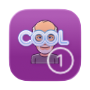

# Liquid Glass Controls and Views

 This is the starter project for the  first video on the applying the new Liquid Glass effects to button controls and views.

If you want to support my work, you can -  

